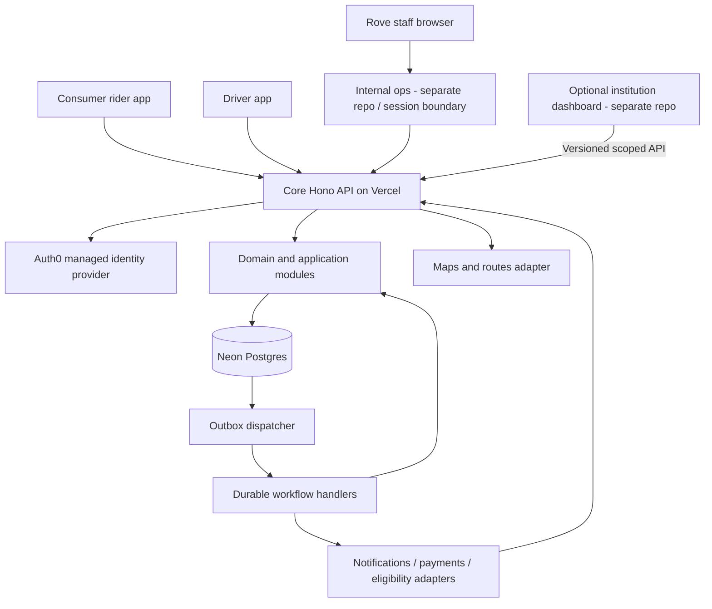

# System architecture

Status: implemented core architecture with planned extensions; hosted staging is deployed. Current evidence and launch gaps are in [implementation status](18-implementation-status.md). Owner: engineering lead. Consumer on-demand rides are the core; internal staff and optional institution dashboards each have a separate frontend repository.

## Baseline choices

| Layer | Baseline | Why |
| --- | --- | --- |
| Monorepo | pnpm workspaces + Turborepo | One lockfile, explicit dependencies, affected builds/tests |
| Mobile | React Native + Expo + Expo Router | Two native applications sharing suitable code across iOS/Android |
| Internal operations web | Next.js + TypeScript in separate internal-dashboard repository | Essential Rove staff support/safety UI, distinct from the B2B customer product |
| HTTP API | Hono on Node.js, deployed on Vercel | Small transport layer, independently deployable API |
| Domain | Plain TypeScript modules on the server | Rules can be tested without React, HTTP, or vendor SDKs |
| Database | Neon Postgres + Drizzle | Relational constraints, migrations, transactions, portable SQL |
| Validation/contracts | Zod schemas in `packages/contracts` | Runtime validation; cross-repository OpenAPI/client publication remains a release task |
| Client server-state | Shared typed API client, focus polling and WebSocket controllers in `mobile-core` | Authorized reads, cancellation, invalidation and recovery |
| Background jobs | Postgres outbox + Vercel Queues and recovery cron | Durable matching/payment/notification work; field latency and operational recovery remain acceptance gates |
| Maps | Google Maps/Places/Routes adapters | Map display, addresses, routes; in-app Navigation SDK on the driver app |
| Authentication | Auth0, Expo AuthSession PKCE and backend OIDC | Native staging clients configured; physical-device and staff MFA acceptance remain separate |

These are architecture choices, not instructions to install every latest package. During bootstrap, pin a stable Node LTS, pnpm version, Expo SDK, and compatible React/React Native versions. Prefer the stable supported versions over release candidates. Record the tested matrix and upgrade it deliberately.

## Runtime view



All durable ride and financial truth resides in Postgres. Client caches, push notifications, maps, and realtime connections are projections. A dropped notification cannot lose a booking; a reconnect reloads authoritative state.

The backend is a **modular monolith**: one application with enforceable internal boundaries, not a collection of independently deployed services. Jobs reuse its application use cases. Split services only when measured load, team ownership, compliance boundaries, or independent availability justify the cost.

## Implemented layout

```text
apps/
  rider/          # Expo rider routes and features
  driver/         # Expo driver routes, navigation and native tracking
  api/            # Hono HTTP, realtime and worker hosts
packages/
  contracts/      # Runtime-validated wire schemas
  server/         # Domain services and provider adapters
  database/       # Drizzle schema and versioned SQL migrations
  mobile-core/    # Typed API client, auth, polling, sockets and recovery
  mobile-ui/      # Shared native components and theme
infra/aws/        # Driver-document infrastructure template
e2e/              # Synthetic browser journeys
docs/
```

The staff and optional institutional dashboards are outside this checkout. Neither receives core database credentials or imports server modules. Cross-repository contract publication/version compatibility remains part of release engineering; do not describe an ungenerated client as an existing artifact.

## Dependency rules

- `contracts` and shared theme values must remain platform-neutral and safe for public bundles.
- Mobile and browser code may import `contracts`, `mobile-core`, and suitable UI packages. They must not import `server`, `database`, payment-secret SDKs, or environment loaders containing secrets.
- `api` composes `server`, `database`, and provider adapters. `database` implements repository ports defined by the relevant server module; type-only port imports must not create runtime cycles.
- `server` owns domain invariants and repository/provider interfaces. Its pure domain layer cannot import Hono, React, Drizzle, or a provider SDK. Concrete adapters live in explicitly named infrastructure directories.
- The separate internal-dashboard server code verifies Rove staff sessions and forwards scoped requests to `api`; it does not run its own ride mutations or access the database directly. The separate B2B web proxy follows the same rule with institution-scoped capabilities and cannot use staff credentials.
- Packages never import from an `apps/` directory. Cross-module backend calls use a documented public interface, never another module's private tables or internal implementation files.

Enforce these with package exports, TypeScript project configuration, lint import restrictions and an architecture dependency check. A README alone is not enforcement. Avoid circular barrel exports; choose explicit public entrypoints.

## Backend module boundaries

| Module | Owns | Public operations |
| --- | --- | --- |
| Identity/access | Platform accounts and staff roles; optional memberships/delegations | Resolve actor; authorize capability without requiring organization membership |
| Rider profiles | Contact preferences and assistance needs | Update own/authorized profile |
| Quotes/pricing | Quote expiry, fare-policy versions and accepted inputs | Quote ride; calculate final fare under accepted policy |
| Availability/matching | Online sessions, location freshness, offers, deadlines | Find eligible driver; expire/accept offers atomically |
| Scheduling (extension) | Templates, occurrences, exceptions, journeys | Request/change schedules; generate legs |
| Rides | Leg lifecycle, status events, completion evidence | Request/cancel/advance ride |
| Dispatch | Assignment records and staff exception intervention | Claim/reassign work; audit overrides |
| Fleet/eligibility | Driver and vehicle capability/validity | Check eligibility at assignment and start |
| Tracking | Online discovery and active-trip location sessions | Ingest sample; expose only appropriately scoped positions |
| Billing | Consumer payment methods, authorizations, fares, payables, ledger | Authorize/capture/refund; settle/reconcile; optional sponsor adapter |
| Organizations (extension) | Customer memberships, programs, sponsorship | Authorize institutional use without owning consumer profiles/fleet |
| Notifications | Delivery intents, channels, receipts | Deliver a domain event notification |
| Audit/operations | Audit entries and operational exceptions | Review scoped history; resolve exceptions |

A transaction crossing related modules is allowed inside a use case, for example completing a ride and recording a settlement intent. The transaction context must be explicit. Avoid network calls while holding database locks.

## Request and event path

1. Transport validates size, content type, authentication and the request schema.
2. A use case resolves platform identity and resource permissions; checks organization/relationship permissions only for features that use them.
3. Domain rules validate the transition and business policy.
4. A database transaction applies the state change, appends its event/audit records, and inserts required outbox intents.
5. Commit before returning success. Serialization/deadlock failures receive bounded retries where safe.
6. An outbox dispatcher starts durable jobs. A failed handoff remains retryable in the database.
7. Delivery and payment adapters deduplicate external effects; callbacks are verified and reconciled.

Handlers remain thin. They map HTTP inputs/errors; they do not contain scheduling or pricing algorithms.

## Realtime and scale

The consumer critical path is quote -> request -> matching -> time-limited offer -> atomic acceptance -> trip -> settlement. The matching loop uses fresh online sessions and bounded proximity/ETA candidates. Discovery location is available only to the platform; precise pickup tracking is exposed only to the matched rider or another explicitly authorized viewer. Sequential offers are the initial policy; persistent deadlines and transactional claims remain correct under delayed/duplicate workers.

Second-scale offer deadlines require a measured executor wakeup/latency budget. Do not use a minute-level cron sweep as the main matching timer. Benchmark Vercel Workflow or a suitable delayed-job executor before locking the provider; database deadline checks enforce expiry even when jobs run late. Monitoring must detect time-to-match regressions.

Native GPS requests three-second delivery; the rider reloads authorized coordinates on WebSocket invalidation and falls back to five-second polling. Driver offers and ride-state screens retain foreground polling. These are implementation intervals, not launch SLAs. Online unassigned drivers also need heartbeats/discovery location with an explicit retention and battery policy. Go-offline stops discovery collection; stale sessions are ineligible for matching.

Trip messaging uses native Vercel WebSockets with transaction-bound Postgres notifications across instances and authorized HTTPS reads for durable state. Reconnect reloads missed history; polling is a transport-failure fallback. See [real-time messaging](realtime-messaging.md) for authentication, direct-session configuration, limits and deployment verification. Rider location shares this socket with capability-aware fallback. Offer/ride-state refresh remains bounded polling; native GPS sampling is a separate OS-controlled channel.

The first backend and database should share the Ohio region where practical (Neon `us-east-2`, Vercel `cle1`). Verify actual project settings before deployment. Auth, maps and notification dependencies have independent failure modes and data locations.

## What this architecture intentionally postpones

No Kubernetes, distributed microservices, Kafka cluster, general event sourcing, global active-active writes, AI dispatch, or mandatory Redis dependency at bootstrap. Automated matching is required; AI matching, surge pricing and pooled optimization are not. Recurrence and institution funding are extensions. The ride history and financial ledger are purpose-specific records, not a requirement to reconstruct the entire database from events.

Platform references: [Expo monorepos](https://docs.expo.dev/guides/monorepos/), [Vercel monorepos](https://vercel.com/docs/monorepos), [Hono on Vercel](https://vercel.com/docs/frameworks/backend/hono), and [Turborepo](https://turborepo.dev/docs).

## Feature access boundary

Scheduling uses a server-side FeatureAccess port with a recommended Vercel Flags core-library adapter for Hono, subject to integration proof. Mobile clients consume sanitized effective capabilities from the core API; they do not import server SDKs or hold provider keys. Flags gate new commitments, not execution/cancellation of accepted work. See [scheduling rollout](17-scheduling-feature-flags.md).
