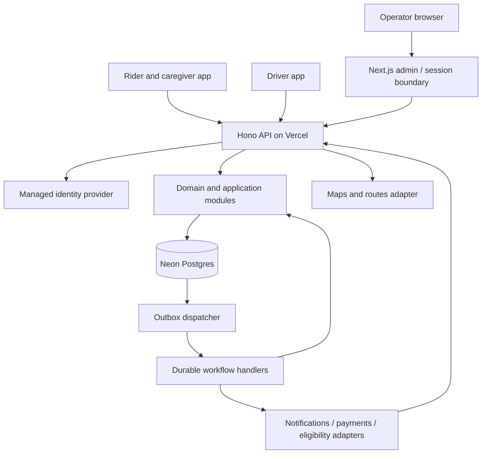

# System architecture

Status: target design, not deployed infrastructure. Owner: engineering lead.

## Baseline choices

| Layer | Baseline | Why |
| --- | --- | --- |
| Monorepo | pnpm workspaces + Turborepo | One lockfile, explicit dependencies, affected builds/tests |
| Mobile | React Native + Expo + Expo Router | Two native applications sharing suitable code across iOS/Android |
| Operations web | Next.js + TypeScript | Accessible operator UI with a server-side session boundary |
| HTTP API | Hono on Node.js, deployed on Vercel | Small transport layer, independently deployable API |
| Domain | Plain TypeScript modules on the server | Rules can be tested without React, HTTP, or vendor SDKs |
| Database | Neon Postgres + Drizzle | Relational constraints, migrations, transactions, portable SQL |
| Validation/contracts | Zod and generated OpenAPI | Runtime validation plus explicit versioned wire contracts |
| Client server-state | TanStack Query | Requests, invalidation, refresh and retry policies in one place |
| Background jobs | Postgres outbox + Vercel Workflow adapter | Durable intent, retries, and repair after partial failures |
| Maps | Google Maps/Places/Routes adapters | Map display, addresses, routes; native navigation handoff first |
| Authentication | Managed provider; selection gate before feature work | Avoid custom passwords/OTP; prove native and admin requirements |

These are architecture choices, not instructions to install every latest package. During bootstrap, pin a stable Node LTS, pnpm version, Expo SDK, and compatible React/React Native versions. Prefer the stable supported versions over release candidates. Record the tested matrix and upgrade it deliberately.

## Runtime view



All durable ride and financial truth resides in Postgres. Client caches, push notifications, maps, and realtime connections are projections. A dropped notification cannot lose a booking; a reconnect reloads authoritative state.

The backend is a **modular monolith**: one application with enforceable internal boundaries, not a collection of independently deployed services. Jobs reuse its application use cases. Split services only when measured load, team ownership, compliance boundaries, or independent availability justify the cost.

## Proposed layout

```text
apps/
  rider/                     # Expo routes and rider/caregiver features
  driver/                    # Expo routes and driver features
  admin/                     # Next.js UI and session/API proxy
  api/                       # Hono routes, bootstrapping, job entrypoints
packages/
  contracts/                 # Public DTO schemas, API errors, OpenAPI generation
  api-client/                # Generated/typed client with transport hooks
  server/                    # Domain modules, use cases, ports, integration adapters
  database/                  # Drizzle schema, SQL repositories, migrations
  mobile-ui/                 # Shared native primitives, when real reuse exists
  design-tokens/             # Platform-neutral branding tokens
  config/                    # TypeScript, lint and test configuration
  test-support/              # Synthetic factories and contract fixtures
docs/
```

Do not create empty abstraction packages solely to match the diagram. Add a package when its boundary or reuse has a concrete purpose. Do not try to share DOM components with native screens. Share tokens, validation, and native components where behavior matches.

## Dependency rules

- `contracts` and `design-tokens` must remain platform-neutral and safe for public bundles.
- Mobile and browser code may import `contracts`, `api-client`, and suitable UI packages. They must not import `server`, `database`, payment-secret SDKs, or environment loaders containing secrets.
- `api` composes `server`, `database`, and provider adapters. `database` implements repository ports defined by the relevant server module; type-only port imports must not create runtime cycles.
- `server` owns domain invariants and repository/provider interfaces. Its pure domain layer cannot import Hono, React, Drizzle, or a provider SDK. Concrete adapters live in explicitly named infrastructure directories.
- `admin` server code verifies its session and forwards user-scoped requests to `api`; it does not run its own copy of ride mutations or access the database directly.
- Packages never import from an `apps/` directory. Cross-module backend calls use a documented public interface, never another module's private tables or internal implementation files.

Enforce these with package exports, TypeScript project configuration, lint import restrictions and an architecture dependency check. A README alone is not enforcement. Avoid circular barrel exports; choose explicit public entrypoints.

## Backend module boundaries

| Module | Owns | Public operations |
| --- | --- | --- |
| Identity/access | Subject mapping, memberships, delegations | Resolve actor; authorize capability |
| Rider profiles | Contact preferences and assistance needs | Update own/authorized profile |
| Scheduling | Templates, occurrences, exceptions, journeys | Request/change schedules; generate legs |
| Rides | Leg lifecycle, status events, completion evidence | Request/cancel/advance ride |
| Dispatch | Driver offers, assignments, coverage | Offer/accept/reassign work |
| Fleet/eligibility | Driver and vehicle capability/validity | Check eligibility at assignment and start |
| Tracking | Location sessions, latest position, retention | Ingest sample; read authorized position |
| Billing | Rate snapshots, authorizations, ledger, reconciliation | Reserve/release/settle; reconcile |
| Notifications | Delivery intents, channels, receipts | Deliver a domain event notification |
| Audit/operations | Audit entries and operational exceptions | Review scoped history; resolve exceptions |

A transaction crossing related modules is allowed inside a use case, for example completing a ride and recording a settlement intent. The transaction context must be explicit. Avoid network calls while holding database locks.

## Request and event path

1. Transport validates size, content type, authentication and the request schema.
2. A use case resolves the actor's current organization/relationship permissions.
3. Domain rules validate the transition and business policy.
4. A database transaction applies the state change, appends its event/audit records, and inserts required outbox intents.
5. Commit before returning success. Serialization/deadlock failures receive bounded retries where safe.
6. An outbox dispatcher starts durable jobs. A failed handoff remains retryable in the database.
7. Delivery and payment adapters deduplicate external effects; callbacks are verified and reconciled.

Handlers remain thin. They map HTTP inputs/errors; they do not contain scheduling or pricing algorithms.

## Realtime and scale

First functional milestone: HTTPS location ingestion plus bounded polling by active ride viewers. Proposed starting cadences: upload every 10 seconds while moving on an active leg, poll every 15 seconds while a viewer screen is visible. These are test parameters, not guaranteed OS scheduling or launch SLAs. Tune after measuring battery, cellular cost, freshness, and server load.

Before the pilot, compare this baseline with native Vercel WebSockets or a managed realtime provider. Authentication, resubscription, token revocation, fanout across instances, reconnect limits, and costs must be demonstrated. Do not assume a separate WebSocket host is required; equally, do not assume a single function's memory can coordinate a fleet. See [decisions](12-decisions.md).

The first backend and database should share the Ohio region where practical (Neon `us-east-2`, Vercel `cle1`). Verify actual project settings before deployment. Auth, maps and notification dependencies have independent failure modes and data locations.

## What this architecture intentionally postpones

No Kubernetes, distributed microservices, Kafka cluster, general event sourcing, global active-active writes, AI dispatch, or mandatory Redis dependency at bootstrap. The append-only ride history and financial ledger are purpose-specific records, not a requirement to reconstruct the entire database from events.

Platform references: [Expo monorepos](https://docs.expo.dev/guides/monorepos/), [Vercel monorepos](https://vercel.com/docs/monorepos), [Hono on Vercel](https://vercel.com/docs/frameworks/backend/hono), and [Turborepo](https://turborepo.dev/docs).
