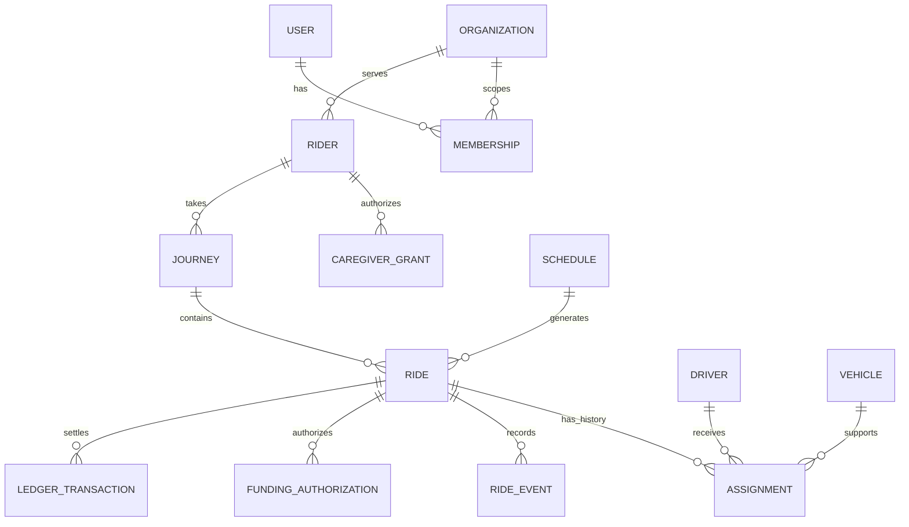

# Data model, consistency, and migrations

Status: conceptual schema. No tables are created by this document. Use SQL constraints to protect invariants even when two requests arrive simultaneously.

## Conventions

Use UUID identifiers, `timestamptz` for actual instants, and explicit IANA time zones for civil schedules. Store currency amounts as integer minor units with a currency code; never calculate fares using JavaScript floating point. Do not serialize JavaScript `bigint` directly in JSON: represent large integer values as validated decimal strings where necessary.

Every tenant-owned record includes `organization_id`. Composite foreign keys and unique keys include this scope where they establish ownership. A guessed UUID is never authorization. Record `created_at`, and `updated_at` or an immutable event timestamp as appropriate. Mutable aggregates use an integer `version` for optimistic concurrency.

## Entity inventory

| Entity | Important fields / relationships | Required invariants |
| --- | --- | --- |
| `users` | Internal id, unique identity-provider subject, account state | Provider identity separate from authorization |
| `organizations` | Name, operational status, timezone | Disabled tenant cannot initiate new operations |
| `memberships` | Organization, user, role, status | Unique membership/role as modeled; explicit active scope |
| `rider_profiles` | Organization, optional user, contact preferences | Supports operator-assisted riders without login |
| `caregiver_grants` | Rider, caregiver user, capabilities, expiry, revoked time | No self-issued grant; revoke affects reads and writes |
| `service_programs` | Organization, service area, payer/contract reference | Rules versioned; eligibility checked per ride |
| `enrollments` | Rider, program, authorized period/caps | Active enrollment does not imply unlimited funding |
| `driver_profiles` | User, organization, operational eligibility | Login does not mean approved to drive |
| `vehicles` | Organization, driver association, capabilities | Verified capacity/assistance support |
| `credentials` | Driver/vehicle reference, category, verification, expiry | Store minimal verification metadata, private document refs only |
| `journeys` | Rider, program, outbound/return relationship | A journey can hold independent one-way legs |
| `schedule_templates` | Local recurrence, timezone, effective dates, version | Finite generation horizon; bounded recurrence rules |
| `schedule_exceptions` | Template, local date, leg type, override/cancel | Unique exception key; history of amendments |
| `rides` | Journey, rider, addresses, pickup window, desired arrival, state, version | Valid time windows; immutable accepted rate snapshot |
| `assignments` | Ride, driver, vehicle, offer state, planned service interval | At most one active assignment per leg |
| `ride_events` | Ride, type, actor, occurred/received time, sequence | Append-only; unique command/event keys |
| `location_sessions` | Driver, assignment, session epoch, expiry | Tracking bound to current assignment |
| `latest_locations` | Session, coordinates, accuracy, recorded/received time, sequence | Older samples cannot overwrite newer samples |
| `location_samples` | Partitionable retained history | Bounded retention; no indefinite GPS archive |
| `rate_versions` | Contract rates, effective interval | Historical rides retain their rate inputs/results |
| `funding_authorizations` | Ride, payer, reserved amount, state | Unique active authorization; atomic cap/balance check |
| `ledger_transactions` / `ledger_entries` | Currency, accounts, amounts, source id | Entries balance per transaction/currency; append-only corrections |
| `payment_attempts` | Provider id, business operation key, reconciled status | Unique provider/business keys; retries do not duplicate money movement |
| `outbox` | Event id, payload reference, due time, lease, attempts | Committed alongside business mutation |
| `webhook_receipts` | Provider, unique event id, verified time, processing state | Duplicate delivery is harmless |
| `notification_deliveries` | Event, recipient, channel, attempt/receipt state | Unique logical delivery key |
| `audit_entries` | Actor, tenant, action, resource, reason, request id | No tokens or full sensitive payloads |

Keep core searchable fields typed. JSON is appropriate for bounded provider metadata and versioned event payloads, not for hiding relational ownership or financial balances.

## Relationship sketch

## Assignment consistency

A partial unique index protects one active assignment per ride. To prevent overlapping work, model a planned busy interval that includes configured travel/service buffers. Use a PostgreSQL exclusion constraint on active driver/vehicle reservations where supported, or serialize reservations by locking the driver/vehicle row and rechecking conflicts inside the same transaction. Test either implementation with concurrent real database transactions.

A planned interval is a conservative scheduling constraint, not proof a driver will arrive on time. Actual overruns raise dispatch exceptions. Check credential expiry against the scheduled service time, then recheck before the trip starts. Changing an assignment invalidates the prior tracking session and access.

## Recurrence and time

Store local start time, timezone such as `America/New_York`, allowed weekdays, start/end dates, and schedule version. Generate actual UTC instants from those values. Uniqueness should identify `(organization, schedule, local_service_date, leg_kind)`; a template version must not accidentally permit duplicate legs for the same occurrence.

Define DST behavior: a nonexistent local time requires operator resolution rather than silently moving the pickup; an ambiguous time requires an explicit offset selection persisted for that occurrence. Re-running generation is idempotent. Editing a schedule changes only the chosen future unstarted occurrences, preserves old events, and reconciles coverage/funding. The generation job must not overwrite manual exceptions.

## Money and sponsored accounts

Model payer authorization separately from driver earnings and platform revenue. Prepaid and invoiced programs need different policies; choose the pilot's policy before implementing real settlement. A funding source must not become a generic transferable consumer wallet by accident.

For prepaid programs, reserve the approved amount atomically before confirming a funded ride. Available funding is derived from posted funds, valid reservations, and settled debits under an explicit policy. Parallel bookings cannot both spend the same balance. Completed rides settle once; cancellation releases a reservation according to policy. Corrections create reversal/adjustment entries, not edited history.

External payment calls do not participate in a SQL transaction. Commit an intent first; use a stable provider idempotency key; record/verify callbacks; reconcile unknown outcomes before retrying a charge or transfer. A ride can be completed while settlement is pending or disputed. Never roll back the physical ride state because a payment provider is unavailable.

Processor fees, refunds, disputes, who is merchant of record, and driver payout responsibility require an approved payments decision. Stripe Connect is a candidate adapter, not a license to collect, hold, or remit funds under any proposed model. [Stripe charge models](https://docs.stripe.com/connect/charges)

## Database connections

Use pooled application connections and a driver that supports the transactions required by dispatch and billing. Drizzle with `pg` against Neon's pooled connection is the initial Node.js baseline; confirm connection lifecycle under Vercel and cap pool size per instance. Use request/transaction-scoped clients and always release in `finally`.

Do not assume a stateless HTTP query helper supports arbitrary interactive transactions. If selecting Neon's serverless driver, validate its appropriate transaction mode with the actual application use case. Migration credentials are separate from application credentials and use the connection mode required by the migration tool. [Drizzle Neon connections](https://orm.drizzle.team/docs/connect-neon)

## Index and query plan

Start with organization + scheduled time/state indexes for dispatch, rider + scheduled time for history, driver + active assignment, template occurrence uniqueness, provider event ids, and outbox due-time/lease indexes. Add geospatial indexes only when implementing spatial queries; use PostGIS if supported by the selected database setup. Route travel time comes from the routing provider, not straight-line distance.

Paginate history with a stable cursor and bounded page size. Query only columns the actor may see. Include representative cardinality and `EXPLAIN` evidence for expensive list/dispatch queries before increasing infrastructure capacity.

## Migration process

1. Change the typed schema and generate a versioned migration; inspect the SQL.
2. Apply all migrations to an empty disposable database, then upgrade a database at the previous schema with synthetic representative data.
3. Use expand-and-contract: add compatible fields/tables, deploy readers/writers, backfill in resumable batches, observe, then remove obsolete fields after old clients are no longer dependent.
4. Separate large backfills and index operations from request traffic; assess lock duration and tool support for concurrent indexes.
5. Run migration once from a serialized, controlled release job. Never run migrations from mobile startup or every Vercel build.
6. Record migration id, release SHA, environment, and result. Prefer forward repairs. Test restore separately; restoring a database can discard newer valid operations and is not a routine code rollback.

Retention and deletion policies must distinguish financial obligations, audit needs, contact information, and fine-grained location. Proposed development data is entirely synthetic. Before pilot launch, approve a retention matrix and test deletion/export behavior, including backup expiration and legal holds. See [security](06-security-and-privacy.md).
