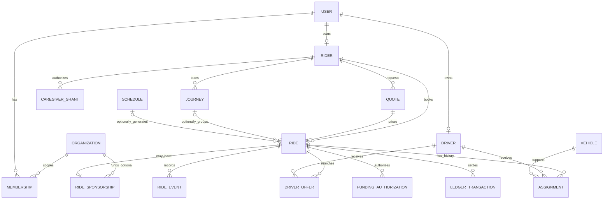

# Data model, consistency, and migrations

Status: conceptual schema. No tables are created by this document. Use SQL constraints to protect invariants even when two requests arrive simultaneously.

## Conventions

Use UUID identifiers, `timestamptz` for actual instants, and explicit IANA time zones for civil schedules. Store currency amounts as integer minor units with a currency code; never calculate fares using JavaScript floating point. Do not serialize JavaScript `bigint` directly in JSON: represent large integer values as validated decimal strings where necessary.

Consumer accounts, vehicles, quotes and rides are platform-owned records with explicit rider/driver ownership; they do not require `organization_id`. Do not create a fake default institution for consumers. Optional B2B-owned records carry `organization_id` and composite ownership constraints. An explicit `ride_sponsorships` association grants limited institution scope without exposing the rider's personal trips. A guessed UUID is never authorization. Record timestamps and use an integer `version` for mutable aggregates.

## Entity inventory

| Entity | Important fields / relationships | Required invariants |
| --- | --- | --- |
| `users` | Internal id, unique identity-provider subject, account state | Provider identity separate from authorization |
| `staff_roles` | Platform user, capability, grant/revoke history | Institution roles never imply Rove staff access |
| `markets` | Service boundary, hours, enabled service types | Geographic policy; not an institutional tenant |
| `organizations` (extension) | Customer name, entitlement, timezone | Disabled customer cannot initiate new B2B operations; existing trips need safe resolution |
| `memberships` (extension) | Organization, user, role, status | Explicit B2B scope; not needed for consumer accounts |
| `rider_profiles` | User, contact preferences; defined guest identity only if supported | Consumer profile independent of institutions |
| `caregiver_grants` | Rider, caregiver user, capabilities, expiry, revoked time | No self-issued grant; revoke affects reads and writes |
| `service_programs` | Organization, service area, payer/contract reference | Rules versioned; eligibility checked per ride |
| `enrollments` | Rider, program, authorized period/caps | Active enrollment does not imply unlimited funding |
| `driver_profiles` | Platform user, permitted markets, eligibility | Global platform supply; not owned by a sponsoring institution |
| `vehicles` | Verified driver/owner association, capabilities | Verified capacity/service support |
| `driver_availability` | Driver, online session epoch, heartbeat, state | Stale/offline/busy driver cannot win a new assignment |
| `quotes` | Rider, route inputs, service/market, amount/currency, rate version, expiry | Immutable accepted inputs; one request consumes a quote under policy |
| `match_attempts` | Ride, generation, deadline, candidate progress | Retryable persisted search; terminal ride cannot restart matching |
| `driver_offers` | Ride, driver, match generation, expires_at, state | Unique logical offer; acceptance checks expiry/current generation atomically |
| `credentials` | Driver/vehicle reference, category, verification, expiry | Store minimal verification metadata, private document refs only |
| `journeys` | Rider, program, outbound/return relationship | A journey can hold independent one-way legs |
| `schedule_templates` | Local recurrence, timezone, effective dates, version | Finite generation horizon; bounded recurrence rules |
| `schedule_exceptions` | Template, local date, leg type, override/cancel | Unique exception key; history of amendments |
| `rides` | Rider, requested_by, market, quote, request kind, addresses, state, version; optional journey/scheduled times | On-demand timing valid without a schedule/program; no institution required |
| `assignments` | Ride, driver, vehicle, offer state, planned service interval | At most one active assignment per leg |
| `ride_events` | Ride, type, actor, occurred/received time, sequence | Append-only; unique command/event keys |
| `location_sessions` | Driver, purpose (online discovery or active trip), optional assignment, epoch, expiry | Discovery private to matching; trip views scoped to current assignment |
| `latest_locations` | Session, coordinates, accuracy, recorded/received time, sequence | Older samples cannot overwrite newer samples |
| `location_samples` | Partitionable retained history | Bounded retention; no indefinite GPS archive |
| `rate_versions` | Consumer market/service pricing and optional contract rates, effective interval | Historical quotes/rides retain accepted inputs and final-fare rules |
| `payment_methods` | Rider, provider token/reference, safe display fields | Provider-owned raw payment details; never store PAN/CVC |
| `funding_authorizations` | Ride, source type, payer/provider authorization, amount, state | Exactly one selected source policy; no implicit consumer/sponsor fallback |
| `ride_sponsorships` (extension) | Ride, organization/program, authorization | Explicit optional association; no access to unrelated rider history |
| `ledger_transactions` / `ledger_entries` | Currency, accounts, amounts, source id | Entries balance per transaction/currency; append-only corrections |
| `payment_attempts` | Provider id, business operation key, reconciled status | Unique provider/business keys; retries do not duplicate money movement |
| `outbox` | Event id, payload reference, due time, lease, attempts | Committed alongside business mutation |
| `webhook_receipts` | Provider, unique event id, verified time, processing state | Duplicate delivery is harmless |
| `notification_deliveries` | Event, recipient, channel, attempt/receipt state | Unique logical delivery key |
| `audit_entries` | Actor, optional organization context, action, resource, reason, request id | Consumer audit does not need a tenant; no tokens/full sensitive payloads |

Keep core searchable fields typed. JSON is appropriate for bounded provider metadata and versioned event payloads, not for hiding relational ownership or financial balances.

Caregiver grants, service programs, enrollments, recurrence templates, journeys/returns and sponsorship are extension entities. They may be added later; initial consumer booking must succeed without any rows or enabled modules for these features. Initial database authorization is based on platform ownership and accepted assignments, not mandatory tenant membership.

## Relationship sketch

## Assignment consistency

A partial unique index protects one active assignment per ride and one active on-demand trip per driver/vehicle. Accepting an offer locks/checks the ride, offer and driver availability in a consistent order, checks server-clock expiry, current matching generation, eligibility and payment readiness, creates the assignment, marks the driver busy and invalidates other offers in one transaction. A racing cancellation or another acceptance can win, but both cannot succeed. Offline and stale availability disqualify acceptance.

For future scheduled work, model a conservative planned busy interval including travel/service buffers. Use an exclusion constraint where supported, or lock the driver/vehicle row and check reservation conflicts in the same transaction. Scheduled reservations must also constrain on-demand offers so the platform does not promise conflicting capacity. Test with concurrent real database transactions.

A planned interval is a conservative scheduling constraint, not proof a driver will arrive on time. Actual overruns raise dispatch exceptions. Check credential expiry against the scheduled service time, then recheck before the trip starts. Changing an assignment invalidates the prior tracking session and access.

## Recurrence and time (optional extension)

Store local start time, timezone such as `America/New_York`, allowed weekdays, start/end dates, and schedule version. Generate actual UTC instants from those values. Uniqueness should identify `(schedule_id, local_service_date, leg_kind)`; a template version must not permit duplicate legs. Authorize schedule ownership through the rider and any explicit delegation/sponsorship, not required organization membership.

Define DST behavior: a nonexistent local time requires operator resolution rather than silently moving the pickup; an ambiguous time requires an explicit offset selection persisted for that occurrence. Re-running generation is idempotent. Editing a schedule changes only the chosen future unstarted occurrences, preserves old events, and reconciles coverage/funding. The generation job must not overwrite manual exceptions.

## Consumer payments and optional sponsored accounts

Initial payment is rider-funded. Tokenized methods belong to that rider. A quote captures pricing inputs/version, amount/currency, expiry and whether the final amount is fixed or calculated under disclosed rules. Validate authorization before starting matching according to the chosen payment policy; release holds on no-driver/cancellation. Capture at completion under approved rules, reconcile failed/uncertain capture separately, and post driver payables once. Fare changes require a defined disclosure/authorization flow; a device cannot submit the binding fare.

Model payment state separately from driver earnings and platform revenue. The driver commission/subscription policy remains open and configurable. Optional prepaid/invoiced institutional funding uses a distinct source adapter later. A funding source must not become a transferable consumer wallet or silently substitute for another payer.

For prepaid programs, reserve the approved amount atomically before confirming a funded ride. Available funding is derived from posted funds, valid reservations, and settled debits under an explicit policy. Parallel bookings cannot both spend the same balance. Completed rides settle once; cancellation releases a reservation according to policy. Corrections create reversal/adjustment entries, not edited history.

External payment calls do not participate in a SQL transaction. Commit an intent first; use a stable provider idempotency key; record/verify callbacks; reconcile unknown outcomes before retrying a charge or transfer. A ride can be completed while settlement is pending or disputed. Never roll back the physical ride state because a payment provider is unavailable.

Processor fees, refunds, disputes, who is merchant of record, and driver payout responsibility require an approved payments decision. Stripe Connect is a candidate adapter, not a license to collect, hold, or remit funds under any proposed model. [Stripe charge models](https://docs.stripe.com/connect/charges)

## Database connections

Use pooled application connections and a driver that supports the transactions required by dispatch and billing. Drizzle with `pg` against Neon's pooled connection is the initial Node.js baseline; confirm connection lifecycle under Vercel and cap pool size per instance. Use request/transaction-scoped clients and always release in `finally`.

Do not assume a stateless HTTP query helper supports arbitrary interactive transactions. If selecting Neon's serverless driver, validate its appropriate transaction mode with the actual application use case. Migration credentials are separate from application credentials and use the connection mode required by the migration tool. [Drizzle Neon connections](https://orm.drizzle.team/docs/connect-neon)

## Index and query plan

Start with market + ride state/request time, rider + created time, driver + active assignment, offer deadline/state, availability heartbeat/state, quote expiry, provider event ids and outbox due-time/lease indexes. Add organization scope indexes only for B2B associations. Nearby-driver selection requires bounded spatial queries; validate PostGIS availability and appropriate indexes during matching implementation. Use proximity to shortlist, then routing-provider travel time for ETA ranking under cost limits; straight-line distance is not driving ETA.

Paginate history with a stable cursor and bounded page size. Query only columns the actor may see. Include representative cardinality and `EXPLAIN` evidence for expensive list/dispatch queries before increasing infrastructure capacity.

## Migration process

1. Change the typed schema and generate a versioned migration; inspect the SQL.
2. Apply all migrations to an empty disposable database, then upgrade a database at the previous schema with synthetic representative data.
3. Use expand-and-contract: add compatible fields/tables, deploy readers/writers, backfill in resumable batches, observe, then remove obsolete fields after old clients are no longer dependent.
4. Separate large backfills and index operations from request traffic; assess lock duration and tool support for concurrent indexes.
5. Run migration once from a serialized, controlled release job. Never run migrations from mobile startup or every Vercel build.
6. Record migration id, release SHA, environment, and result. Prefer forward repairs. Test restore separately; restoring a database can discard newer valid operations and is not a routine code rollback.

Retention and deletion policies must distinguish financial obligations, audit needs, contact information, and fine-grained location. Proposed development data is entirely synthetic. Before pilot launch, approve a retention matrix and test deletion/export behavior, including backup expiration and legal holds. See [security](06-security-and-privacy.md).
