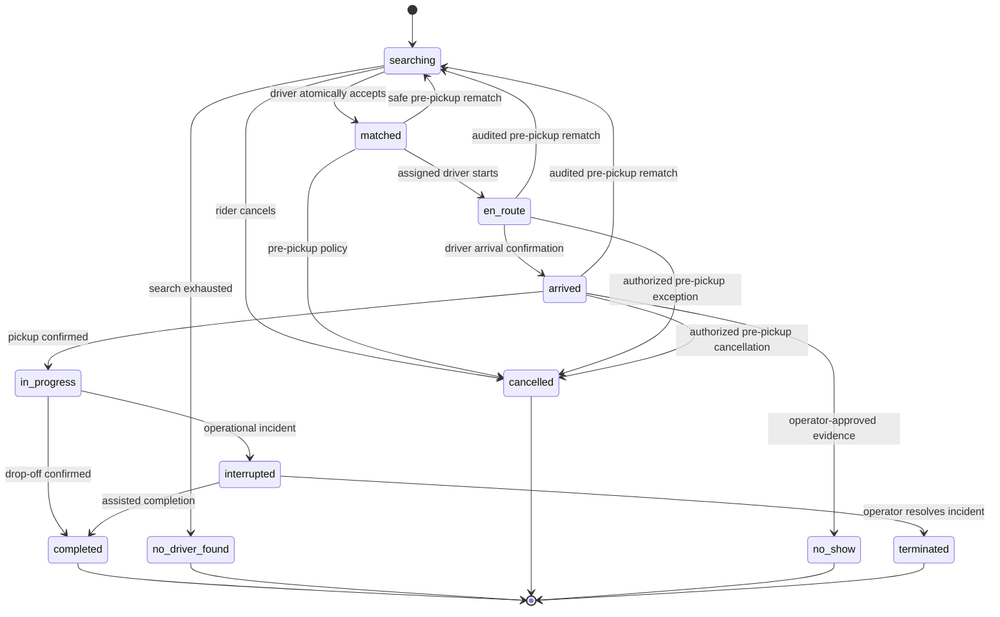

# API contracts and domain behavior

Status: implemented core API with explicitly planned extensions. `apps/api/src/app.ts`, `packages/contracts` and `packages/mobile-core/src/index.ts` are authoritative for routes, payloads and the typed client. This overview is not generated OpenAPI.

## Contract rules

Use HTTPS JSON REST under `/v1`. The current typed client validates responses using canonical schemas in `packages/contracts`. Publishing versioned OpenAPI/client artifacts for external repositories remains release work. Contracts describe transport values, not Drizzle table types. This avoids exposing internal columns or coupling mobile releases to schema changes.

Use consistent status codes: 400 malformed input, 401 invalid/missing authentication, 403 denied capability, 404 missing or deliberately concealed inaccessible resource, 409 state/version/idempotency conflict, 422 invalid business input, 429 rate limit, and 503 retryable dependency/service unavailability. Error responses include a stable code, safe message, request id; never SQL, tokens, or provider internals.

For example, a stale trip transition returns `{"error":{"code":"STALE_RIDE","message":"Your trip has changed. Refresh to continue.","requestId":"example-request"}}`. Clients branch on `code`, never translated text. Choose and test one resource-concealment policy consistently across tenants.

## Implemented route groups

The following map summarizes actual routes; consult `apps/api/src/app.ts` for complete schemas, methods and optional-service availability.

| Routes | Actor/boundary | Current behavior |
| --- | --- | --- |
| `/v1/me`, `/v1/me/capabilities` | Authenticated profile | Registration/read/edit; all-off scheduling capabilities |
| `/v1/places`, `/v1/quotes`, `/v1/ride-requests` | Rider | Place resolution, owned expiring quote and idempotent booking |
| `/v1/saved-places` and `/:kind` | Rider | Owned Home/Work slots |
| `/v1/rides`, `/v1/rides/:id` | Authorized participant | Bounded history and current ride |
| `POST /v1/rides/:id/transitions` | Role/state policy | Expected-version transitions, including rider cancellation; no separate cancel route |
| `/v1/drivers/me`, `/availability`, `/heartbeat`, `/coverage`, `/offers` | Driver | Eligibility, location freshness, 1–100 mile coverage and redacted offers |
| `POST /v1/offers/:id/accept` and `/decline` | Offered driver | Atomic acceptance or idempotent decline |
| `POST /v1/drivers/me/tracking-session`, `/tracking/v1/location`, `/tracking/v1/session` | Driver then location-only grant | Issue, upload and revoke native tracking |
| `GET /v1/rides/:id/driver-location` | Owning rider with active assignment | Minimal expiring location; refreshed through socket invalidations |
| `/v1/conversations`, `/v1/conversations-unread`, `/v1/rides/:id/conversation`, `/v1/conversations/:id` and message/read/report actions | Current participant | Assignment-scoped text messaging and reporting |
| `/v1/realtime` | Authenticated WebSocket | Invalidations; message/location data remains on authorized HTTPS routes |
| `/v1/wallet/customer-session`, `/v1/wallet/setup-session`, `/v1/rides/:id/payment-session` | Rider | Stripe-owned native collection; no raw card data |
| `/v1/rides/:id/receipt`, `/v1/drivers/me/earnings` and `/:id` | Owner | Ledger-backed receipt/recorded earnings |
| `/v1/drivers/me/payout-setup` | Driver | Optional Connect onboarding; not money movement |
| `/v1/drivers/me/vehicle-submission`, `/v1/drivers/me/documents` and upload/complete actions | Driver | Vehicle/evidence submission |
| `/v1/support-requests` | Signed-in account | Intake and private history; deletion requests do not execute account deletion |
| `/v1/me/notification-devices`, `/v1/push-installations` and `/status` | Account plus installation proof where required | Optional notification registration, repair and revocation |
| `/v1/staff/...` support, vehicle, document and eligibility routes | Staff capability plus MFA | Audited operational API; dashboard source is separate |
| `/webhooks/stripe`, `/webhooks/stripe-connect` | Provider signature | Durable reconciliation hints |
| `/health/live` | Public | Process liveness only |

`/v1/realtime` is handled by the separate realtime host. Optional services fail unavailable when not configured; a listed route does not prove provider activation. There is no implemented `/health/ready` endpoint. Caregiver grants, organization booking, schedules, return-ready and generic staff assignment routes from the original design remain future extensions, not callable endpoints.

Clients cannot set fares, assign themselves or overwrite ride history. All mutation policy remains in the core backend. The separate dashboards must consume versioned contracts without receiving database credentials.

## Matching and quote behavior

Quote issuance does not reserve a driver. Request creation verifies a quote belongs to the actor, is unexpired, matches route/service inputs and uses the chosen payment authorization policy. Persist the search intent and deadline before returning `searching`. A retry with the same key returns the same ride; also enforce a documented rule for duplicate active requests under different keys.

The worker shortlists online, fresh, eligible drivers in the allowed market, ranks bounded candidates, and persists one time-limited offer at a time. All times use a trusted server clock. A driver can accept only a current, unexpired offer while eligible/available; locks and constraints protect both ride and driver. Late acceptance, duplicate jobs and cancellation races must be safe.

Decline/expiry advances to the next candidate within the search deadline. When exhausted, mark `no_driver_found`, release payment holds under policy and show an explicit retry action. Restarting search requires a new matching generation and current quote/payment validation. Worker delay never extends an expired offer. Benchmark delivery/wakeup latency for short deadlines; a periodic repair sweep is not the main matching timer.

## Ride and assignment state machines (including target exception paths)

The diagram includes planned operator/rematch exception paths; the implemented transition allowlist in `packages/server/src/policy.ts` is authoritative. Do not infer an existing endpoint from an arrow. Keep independent concerns separate: ride execution state, assignment/coverage state, return readiness, and payment state. A paid ride is not necessarily completed; an accepted driver does not mean the passenger was picked up.

`matched` means an eligible driver accepted and the server committed the assignment. Before acceptance, an offer is only an offer. Pre-pickup withdrawal may trigger a bounded rematch with rider visibility, a new matching generation and payment checks; never keep displaying the old driver. Withdrawal after `en_route`/`arrived` uses an audited pre-pickup rematch path invalidating the old assignment/session. No automatic rematch after pickup. Offer states are offered, accepted, declined, expired or superseded; assignment history records accepted work separately. Scheduled coverage/readiness is a later extension.

An operator override needs the specific capability, reason, actor, previous state and resulting state. It is not a generic permission to edit history. A rider cannot mark a driver arrived. A late GPS sample cannot complete a ride. Physical proximity is supporting evidence, never the sole proof of pickup or service delivery.

## Idempotency and concurrent edits

Require `Idempotency-Key` for creation and consequential commands. Store platform actor scope and optional organization context, operation, key, request hash, processing state, result reference and retention deadline. Same key + different payload returns 409. Same successful key returns the prior result after rechecking access. Concurrent same-key requests converge through a constraint. Consumer requests need no tenant; organization context, when present, is validated and cannot be changed by replaying the key.

If processing is ongoing, return a documented conflict/retry response or operation status link. Handle abandoned in-progress keys using a lease and reconciliation. Start with 24-hour HTTP replay storage, but permanent unique business operation ids must prevent duplicate ride occurrence generation or settlement beyond that window. Make the window and maximum supported offline duration explicit in client behavior.

Require aggregate `expectedVersion` on contested changes. Update using a version predicate and increment atomically; return 409 if another actor changed the ride. Refresh and present the conflict rather than automatically overwriting the other user's decision.

## Outbox and job execution

The same transaction that changes a ride records its immutable event and outbox row. The dispatcher leases due rows with bounded batches and database locking, hands them to a durable workflow using the event id as a stable key, and records acceptance. If the process dies after handoff, repeating the handoff or handler must be harmless.

Each handler records its own deduplication key. Apply capped exponential retry with jitter for transient failures; invalid destination/account states fail permanently and create an operator exception. Track attempts, last safe error, next retry, and lease expiration. Provide a dead-letter review and replay operation with audit.

Cancellation/reschedule does not depend on successfully deleting a delayed provider task. Include schedule/ride version in the intent and re-read current state before sending a reminder or initiating a downstream action. Old intents become safe no-ops. Use database reconciliation to find missed outbox processing, stale reservations, and overdue returns.

Scheduled sweeps are authenticated entrypoints that discover persisted due work. Neither `setTimeout`, an in-memory queue, nor `waitUntil` is a durable booking/reminder system. A network failure after an external send may make its outcome uncertain: use provider idempotency where available and recognize that exactly-once SMS delivery cannot be guaranteed merely by using a database.

## Client compatibility

Mobile versions remain installed long after an API deployment. Prefer additive response changes, explicit optional/default behavior, and tolerant handling of unknown display states. Do not introduce an unsafe action for unknown state. Test the latest supported older client contract against the new API.

For a breaking change, create a new contract version or a staged compatibility bridge, measure client adoption, and communicate an upgrade window. Maintain a support matrix. A minimum-version response may block unsupported operations but must provide a support path; do not lock an active driver out mid-trip without an operational fallback.

## Integration failures

Maps unavailable: preserve saved ride details, mark ETA unavailable, offer approved native navigation/contact fallback; never invent an ETA. Identity provider unavailable: fail closed for new protected mutations, apply an explicit documented offline display policy. Notifications unavailable: keep ride records and show dispatcher delivery failures. Payment provider unavailable: retain pending settlement intent and reconcile. Database unavailable: return controlled errors and let operations use the outage runbook.

See [testing](07-testing-strategy.md) for verification and [operations](11-operations-and-costs.md) for recovery targets.

## Mobile capabilities and offer privacy

Implemented `GET /v1/me/capabilities` exposes effective scheduling booleans and expiry only; the runtime returns scheduling disabled. Scheduling mutation/recurrence endpoints are not implemented; their future admission contract must fail closed. Accepted work remains viewable, executable and cancellable. See [flag contract](17-scheduling-feature-flags.md).

Use different allowlisted offer and accepted-assignment DTOs. Before acceptance exclude exact addresses/coordinates, identifying rider details/history and medical/payer data, including indirect leaks through map polylines, push and errors. The offer retains coarse areas, ETA/distance, earnings/terms, expiry and necessary service capability. Assigned exact-route access requires committed acceptance and current assignment permission. See [design contract](16-mobile-design-contract.md).

## Implemented driver tracking boundary

The native background location task authenticates with a separate location-only grant. See [driver location lifecycle](20-driver-location.md) for issuance/upload/revocation endpoints, freshness and authorization rules, native behavior, and verification limits. Do not reuse account refresh tokens in headless location tasks or expose ride reads through tracking credentials.

## Driver transfer operations

The default-off staff transfer endpoints authorize an explicit amount/policy reference, list operations, cancel only before first provider attempt and recover existing provider outcomes. They require verified MFA and `payments.transfer`. Source-scoped reservations and actual provider journals prevent duplicate settlement; confirmation is a connected-account transfer, not bank payout. See [contracts, accounting and rollout](72-driver-transfer-workflow.md).

## Account-deletion consent

The account-deletion confirmation sends `deletionConsent: account-deletion-v1` to `POST /v1/support-requests` with category `account` and the normal idempotency key. The backend atomically creates explicit consent independently of support resolution. `GET /v1/account-deletion` returns the active authenticated consumer's durable request or null. `GET /v1/staff/account-deletions/:id` requires MFA and `privacy.read`, audits inspection and does not mutate the account. No user ID or free-text message can select another account for deletion. Current state is `requested`; fulfillment remains separate. See [deletion workflow and rollout](75-account-deletion.md).
