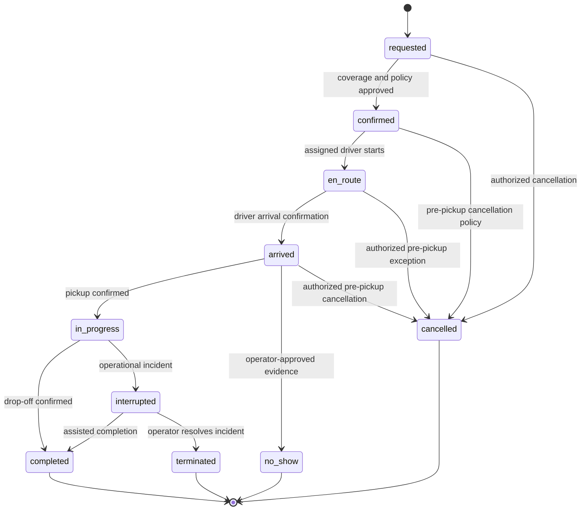

# API contracts and domain behavior

Status: proposed API contract. Paths illustrate the first version and must be implemented with schema validation and authorization tests.

## Contract rules

Use HTTPS JSON REST under `/v1`. Publish OpenAPI from the canonical schemas in `packages/contracts`; generate the API client and verify that checked-in generated output is current. Contracts describe transport values, not Drizzle table types. This avoids exposing internal columns or coupling mobile releases to schema changes.

Use consistent status codes: 400 malformed input, 401 invalid/missing authentication, 403 denied capability, 404 missing or deliberately concealed inaccessible resource, 409 state/version/idempotency conflict, 422 invalid business input, 429 rate limit, and 503 retryable dependency/service unavailability. Error responses include a stable code, safe message, request id and optional field errors; never SQL, tokens, or provider internals.

For example, an assignment conflict returns `{"error":{"code":"RIDE_VERSION_CONFLICT","message":"This ride changed. Refresh before trying again.","requestId":"example-request"}}`. Clients branch on `code`, never translated text. Choose and test one resource-concealment policy consistently across tenants.

## Initial endpoints

| Endpoint | Authorized actor | Important behavior |
| --- | --- | --- |
| `GET /v1/me` | Authenticated user | Current identity, memberships, allowed role contexts |
| `GET /v1/riders/:id` | Rider, scoped delegate/operator | Redacted role-specific representation |
| `POST /v1/caregiver-invitations` | Authorized inviter | Expiring, single-use grant invitation; abuse limits |
| `DELETE /v1/caregiver-grants/:id` | Authorized revoker | Immediate database revocation; notification/session access reconciled |
| `POST /v1/ride-requests` | Rider, grant holder, coordinator | Server-owned tenant, policy/rate evaluation, idempotency |
| `GET /v1/rides` | Scoped actor | Filters within permitted scope; cursor pagination |
| `GET /v1/rides/:id` | Scoped actor | Version, coverage state, leg relationship and freshness |
| `POST /v1/rides/:id/cancel` | Authorized requester/operator | Expected version, reason, linked-return disposition |
| `POST /v1/rides/:id/assignments` | Dispatcher | Transactional availability/eligibility checks |
| `POST /v1/assignments/:id/accept` | Offered driver | Reject expired/replaced offers; current version |
| `POST /v1/rides/:id/transitions` | Assigned driver/operator | Named transition, expected version, evidence and audit |
| `POST /v1/journeys/:id/return-ready` | Rider, delegate, coordinator | Idempotent readiness timestamp; trigger coverage review |
| `POST /v1/schedules` | Authorized requester/operator | Preview dates, bounded recurrence, funding/coverage distinction |
| `PATCH /v1/schedules/:id` | Authorized requester/operator | Single occurrence vs future scope explicitly selected |
| `POST /v1/location-sessions/:id/samples` | Current assigned driver | Bounded batch size; sequence, accuracy and age checks |
| `GET /v1/rides/:id/location` | Authorized active-ride viewer | Minimal latest location; no unrelated trail |
| `POST /v1/webhooks/:provider` | Verified provider | Signature, timestamp and duplicate checks |
| `GET /health/live` | Health probe | Process health only; safe response |
| `GET /health/ready` | Controlled probe | Bounded database/schema readiness check |

Avoid a universal `PATCH /rides/:id` that lets clients assign themselves, set fares, or overwrite state. Each use case owns an allowlist of writable fields. An admin proxy cannot bypass API authorization using a blanket service token.

## Ride and assignment state machines

Keep independent concerns separate: ride execution state, assignment/coverage state, return readiness, and payment state. A paid ride is not necessarily completed; an accepted driver does not mean the passenger was picked up.

`confirmed` means coverage is arranged under the pilot's policy. If a driver declines or becomes ineligible after confirmation, record a coverage exception and reassignment; do not silently claim coverage is still healthy. The execution history stays intact. Assignment states separately progress through offered, accepted, declined, expired, superseded and completed.

An operator override needs the specific capability, reason, actor, previous state and resulting state. It is not a generic permission to edit history. A rider cannot mark a driver arrived. A late GPS sample cannot complete a ride. Physical proximity is supporting evidence, never the sole proof of pickup or service delivery.

## Idempotency and concurrent edits

Require `Idempotency-Key` for creation and financially/operationally consequential commands. Store actor/tenant scope, operation, key, request hash, processing state, result reference and retention deadline. Same key + different payload returns 409. Same successful key returns its prior result after checking the caller still has access. Concurrent same-key requests converge on one database result, rather than checking then inserting without a constraint.

If processing is ongoing, return a documented conflict/retry response or operation status link. Handle abandoned in-progress keys using a lease and reconciliation. Start with 24-hour HTTP replay storage, but permanent unique business operation ids must prevent duplicate ride occurrence generation or settlement beyond that window. Make the window and maximum supported offline duration explicit in client behavior.

Require aggregate `expectedVersion` on contested changes. Update using a version predicate and increment atomically; return 409 if another actor changed the ride. Refresh and present the conflict rather than automatically overwriting the other user's decision.

## Outbox and job execution

The same transaction that changes a ride records its immutable event and outbox row. The dispatcher leases due rows with bounded batches and database locking, hands them to a durable workflow using the event id as a stable key, and records acceptance. If the process dies after handoff, repeating the handoff or handler must be harmless.

Each handler records its own deduplication key. Apply capped exponential retry with jitter for transient failures; invalid destination/account states fail permanently and create an operator exception. Track attempts, last safe error, next retry, and lease expiration. Provide a dead-letter review and replay operation with audit.

Cancellation/reschedule does not depend on successfully deleting a delayed provider task. Include schedule/ride version in the intent and re-read current state before sending a reminder or initiating a downstream action. Old intents become safe no-ops. Use database reconciliation to find missed outbox processing, stale reservations, and overdue returns.

Scheduled sweeps are authenticated entrypoints that discover persisted due work. Neither `setTimeout`, an in-memory queue, nor `waitUntil` is a durable booking/reminder system. A network failure after an external send may make its outcome uncertain: use provider idempotency where available and recognize that exactly-once SMS delivery cannot be guaranteed merely by using a database.

## Client compatibility

Mobile versions remain installed long after an API deployment. Prefer additive response changes, explicit optional/default behavior, and tolerant handling of unknown display states. Do not introduce an unsafe action for unknown state. Test the latest supported older client contract against the new API.

For a breaking change, create a new contract version or a staged compatibility bridge, measure client adoption, and communicate an upgrade window. Maintain a support matrix. A minimum-version response may block unsupported operations but must provide a support path; do not lock an active driver out mid-trip without an operational fallback.

## Integration failures

Maps unavailable: preserve saved ride details, mark ETA unavailable, offer approved native navigation/contact fallback; never invent an ETA. Identity provider unavailable: fail closed for new protected mutations, apply an explicit documented offline display policy. Notifications unavailable: keep ride records and show dispatcher delivery failures. Payment provider unavailable: retain pending settlement intent and reconcile. Database unavailable: return controlled errors and let operations use the outage runbook.

See [testing](07-testing-strategy.md) for verification and [operations](11-operations-and-costs.md) for recovery targets.
